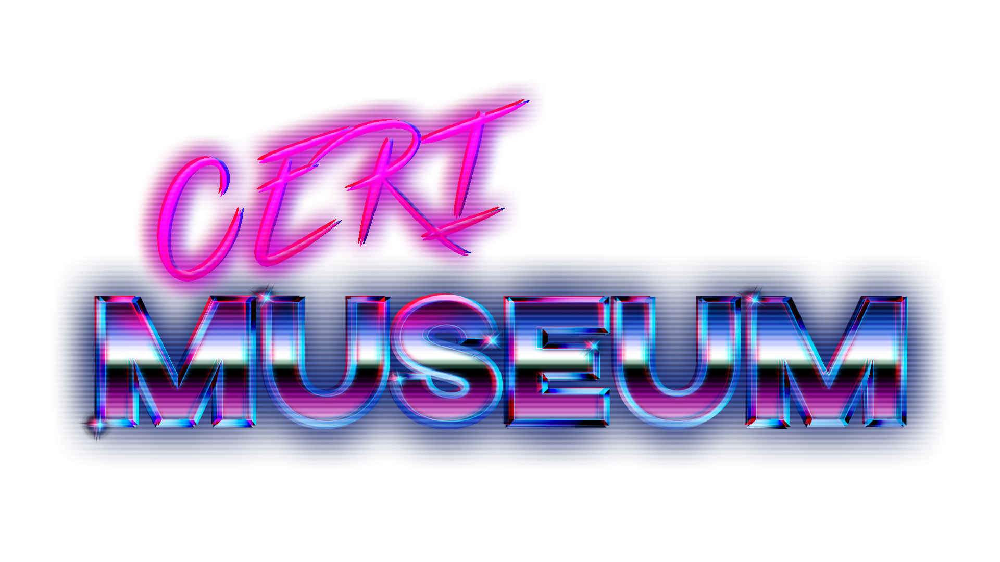

# CERI Museum

## Organization
The source code is organized around the MVC pattern.

* At the root of the project we have :
     * Models
        * Contain all the class for the objects
     * Layout
        * Contain all the vues in the XML format
     * Controllers
        * Contain all the controllers which handle the events of the views
     * Drawable
        * Contain all the resources like the pictures and style-sheets
     * Models > Threads
        * Contain all the AsyncTask

## Installation
Here is the procedure to install this software :
1. Download the *.APK* in the release section
2. Install it on your Android device
3. Run it, close it and run it again

## Development environment
* Android:
    * Install Android Studio: [Install](https://developer.android.com/studio)
    * Clone the current [project](https://github.com/qanastek/Retro-Hardware)
    * Open it & build the project

## Dependencies
The project relies on the following libraries:
* [Glide](https://github.com/bumptech/glide): This library allow you to download, caching and reduce the resolution of an image.

## References
* [Dribble](https://dribbble.com/)
* [Logo](https://www.youtube.com/watch?v=y8brTm5aslo)
* [Background Landscape](https://www.freepik.com/free-vector/retro-futuristic-sci-fi-landscape-background-purple-color_5105319.htm#query=sci%20fi%20landscape&position=0)